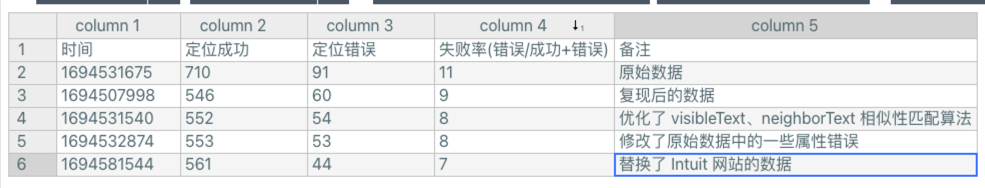

# Similo

-   [基于相似性的 Web 元素本地化实现稳健的测试自动化](https://dl.acm.org/doi/10.1145/3571855 "基于相似性的 Web 元素本地化实现稳健的测试自动化")

    源代码：[https://github.com/michelnass/Similo2](https://github.com/michelnass/Similo2 "https://github.com/michelnass/Similo2")
    #### 名词解释
    **目标元素**：录制用例时，我们点击的元素

    

    候选元素：回放时，页面所有可见的元素

    

### 一、问题

-   [x] web 元素哪些参数会被记录，参数是如何比较的，参数权重是怎样定义的

    

### 二、参数定义

1.  记录的定位器参数
    | 属性名称                    | 权重                                                              | 论文如何比较                                                                                                                                      | 我们的改进            | 如何获取                                                                                                   |
    | ----------------------- | --------------------------------------------------------------- | ------------------------------------------------------------------------------------------------------------------------------------------- | ---------------- | ------------------------------------------------------------------------------------------------------ |
    | tag                     | 1.5                                                             | 相等比较                                                                                                                                        |                  | 标签，例如 a、div                                                                                            |
    | class                   | 0.5                                                             | 编辑距离                                                                                                                                        | Jaccard(雅卡尔) 相似度 | 'ant-table-cell ant-table-cell-ellipsis'                                                               |
    | name                    | 1.5                                                             | 相等比较                                                                                                                                        |                  |                                                                                                        |
    | id                      | 1.5                                                             | 相等比较                                                                                                                                        |                  |                                                                                                        |
    | href                    | 0.5                                                             | 编辑距离                                                                                                                                        |                  |                                                                                                        |
    | alt                     | 0.5                                                             | 编辑距离                                                                                                                                        |                  |                                                                                                        |
    | xpath                   | 0.5                                                             | 编辑距离                                                                                                                                        |                  |                                                                                                        |
    | idxpath                 | 0.5                                                             | 编辑距离                                                                                                                                        |                  |                                                                                                        |
    | is\_button              | 0.5                                                             | 相等比较                                                                                                                                        |                  | 1.  a标签，class 含有 btn&#xA;2\.  button 标签&#xA;3\.  input 标签，type属性为 `['button', 'submit', 'reset']` 中的一种 |
    | location                | 0.5                                                             | 欧氏距离（二维)                                                                                                                                    |                  | (x, y, width, height)                                                                                  |
    | area                    | 0.5                                                             | 欧氏距离（一维）                                                                                                                                    |                  | width\*height                                                                                          |
    | shape                   | 0.5                                                             | 欧氏距离（一维）                                                                                                                                    |                  | width/height                                                                                           |
    | visible\_text           | 1.5                                                             | 编辑距离                                                                                                                                        | Jaccard(雅卡尔) 相似度 | text, value, placeholder                                                                               |
    | neighbor\_text          | 1.5                                                             | 单词相似度                                                                                                                                       | Jaccard(雅卡尔) 相似度 | 获取元素可视区域周围的元素(上下50，左右50)                                                                               |
    | 参数的比较                   |                                                                 |                                                                                                                                             |                  |                                                                                                        |
    | 算法名称                    | 说明                                                              | 示例                                                                                                                                          |                  |                                                                                                        |
    | ----------------------- | --------------------------------------------------------------- | ------------------------------------------------------------------------------------------------------------------------------------------- |                  |                                                                                                        |
    | 编辑距离                    | 两个字串之间由一个转成另一个所需的最少编辑操作次数。允许的编辑操作包括将一个字符替换成另一个字符，插入一个字符，删除一个字符。 | const distance = LevenshteinDistance(s1, s2);&#xA;const score = (s1.length - distance) \* maxScore / s1.length;                             |                  |                                                                                                        |
    | 欧氏距离（一维）                | 两点之间的绝对距离.                                                      | const distance = Math.abs(value1 - value2);&#xA;const max = Math.max(value1, value2);&#xA;const score = (max - distance) \* maxScore / max; |                  |                                                                                                        |
    | 欧氏距离（二维）                | Math.sqrt((x1-x2)\*\*2 + (y1-y2) \*\*2)                         | const pixelDistance = Math.sqrt(dx\**dx + dy*\*dy);&#xA;const similarity = Math.max(100 - pixelDistance, 0))/100;                           |                  |                                                                                                        |
    | 单词相似度&#xA;(Jaccard 相似度) | \|A ∩ B\| / \|A ∪ B\|                                           | A,B 表示单词列表                                                                                                                                  |                  |                                                                                                        |

### 三、定位效果展示


-   Robula+ 是最稳健的单一定位器（39% 未定位)


站点历史记录：

<https://web.archive.org/>

<https://webapps.stackexchange.com/questions/40911/web-archive-links-without-header#comment141775_155393>




新旧网站的平均时间跨度是 32个月（2.7年）

### 性能

```json
{
  site: 34, // 站点数量
  candidateCount: [ // 候选元素数量列表
    544, 367, 1769,  344, 802, 597, 816,
    502, 698, 1916,   81, 372, 372, 167,
    107, 314,  520,  185, 224, 157, 611,
    235, 552,  193, 1259,  84, 909, 125,
     68, 667,  423,  251, 159, 150
  ],
  targetTime: [ // 单个站点目标元素的平均匹配时间
    939, 244, 1401, 132, 354, 734, 608,
    417, 905, 1875,  32, 229, 391, 122,
    103, 208, 1050, 103, 133, 107, 581,
    191, 533,  101, 495,  43, 497,  51,
     24, 573,  470, 114,  59, 122
  ],
  candidateTime: [ // 单个站点，单个目标元素和单个候选元素的匹配时间
     1.7261029411764706,  0.6648501362397821,
     0.7919728660260034, 0.38372093023255816,
    0.44139650872817954,  1.2294807370184255,
     0.7450980392156863,  0.8306772908366534,
     1.2965616045845272,  0.9786012526096033,
     0.3950617283950617,  0.6155913978494624,
     1.0510752688172043,  0.7305389221556886,
     0.9626168224299065,  0.6624203821656051,
      2.019230769230769,  0.5567567567567567,
                0.59375,  0.6815286624203821,
     0.9509001636661211,  0.8127659574468085,
     0.9655797101449275,  0.5233160621761658,
     0.3931691818903892,  0.5119047619047619,
     0.5467546754675467,               0.408,
    0.35294117647058826,  0.8590704647676162,
     1.1111111111111112,  0.4541832669322709,
     0.3710691823899371,  0.8133333333333334
  ],
  averagePerTargetTime: 410, // 所有站点单个目标元素的平均匹配时间
  averagePerCandidateTime: 0.7773862371938323, // 所有站点单个目标元素和单个候选元素的匹配时间
  averagePerCandidateCount: 486 // 候选元素的平均数量
}
```


### 二、分析定位失败的情况

1.  Instagram

    旧网址：login in&#x20;

    

    新网站：元素位置发生了变化（2.879903、2.423507）

    


1.  Intuit

    旧网址：mint 图片元素


新网站：mint 图片元素


### 三、录制站点

-   Bestbuy、Chase,Dropbox 提示 Silimon 脚本注入失败
-   Ebay 录制报错, 提示 javascript error: "id" is required
-   Facebook 先跳过

### 四、实验过程

验证 robula-plus、以及我们的选择器的匹配效果, 以下对实验过程记录的数据结果进行调整

```json
[ {
    "name": "Adobe",
    "url": {
      "old": "https://web.archive.org/web/20180702000525if_/https://www.adobe.com/",
      "new": "https://web.archive.org/web/20201102003024if_/https://www.adobe.com/"
    },
    "xpath": [
      {
        "old": "/html[1]/body[1]/main[1]/section[1]/figure[1]/article[1]/section[1]/ul[1]/li[1]/a[1]",
        "new": "/html[1]/body[1]/div[1]/div[1]/div[2]/div[1]/div[1]/div[1]/div[1]/div[2]/div[1]/div[1]/div[1]/div[1]/div[1]/div[1]/div[1]/div[1]/div[1]/div[1]/div[1]/div[1]/div[2]/div[1]/div[1]/div[1]/div[1]/p[1]/a[1]",
        "result": {
             similo2: { // 基于 web 相似度
               old: {},
               new: {},
               matched: boolean;
             },
             aus: {
               old: 'xxx',
               new: 'yyy',
               matched: boolean;
             },
             robula: {
               old: 'xxx',
               new: 'yyy',
               matched: boolean;
             },
             image: {
               old: 'image_path',
               new: 'image_path',
               matched: boolean;
             }
        }
      },
      {
        "old": "/html[1]/body[1]/main[1]/section[1]/figure[1]/article[1]/section[1]/ul[1]/li[2]/a[1]",
        "new": "/html[1]/body[1]/div[1]/div[1]/div[2]/div[1]/div[1]/div[1]/div[1]/div[2]/div[1]/div[1]/div[1]/div[1]/div[1]/div[1]/div[1]/div[1]/div[1]/div[1]/div[1]/div[1]/div[4]/div[1]/div[1]/div[1]/div[1]/p[1]/a[1]"
      }
    ],
    "diffMonth": 28
  }]
```


